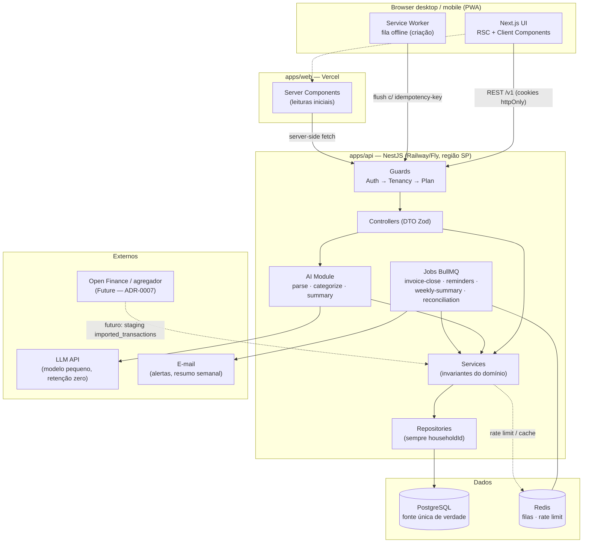
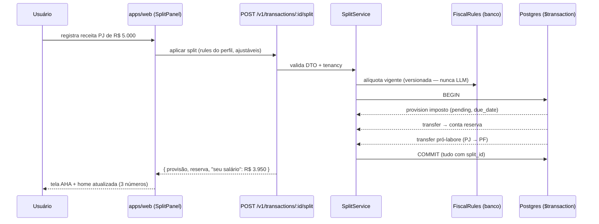
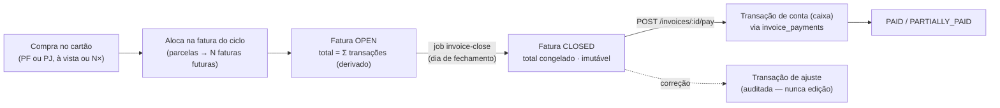
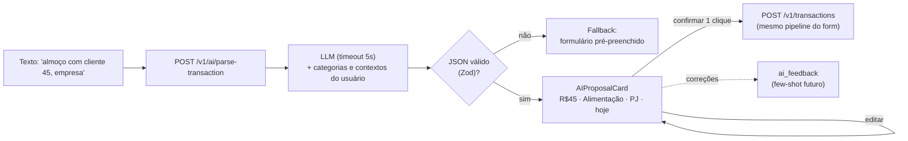

# Tally — Technical Architecture

> Perspectiva: Tech Lead / Staff Engineer.
> Versão: 0.1 · Status: living document
> Decisões formais em `adr/` (referenciadas como ADR-NNNN). Modelo de dados detalhado em `data-model.md`; domínio em `domain-model.md`; ameaças em `threat-model.md`.

---

## 1. Arquitetura técnica (visão geral)

Tally é composto por **duas aplicações num monorepo** (ADR-0004): um frontend Next.js 15 (App Router) na Vercel e uma API NestJS (monólito modular, ADR-0002) com PostgreSQL como fonte única da verdade (ADR-0003) e Redis para filas (BullMQ) e rate limit. A IA v1 é enxuta e proativa: parsing de linguagem natural, categorização e resumo semanal — sem chat aberto no MVP.

Princípios:

- **API como fonte única de verdade:** nenhum estado autoritativo no cliente. Anti-lição direta do benchmark (divergência web ≠ app do Mobills destruiu confiança de usuários).
- **Isolamento por household em toda query** — a camada de repositório sempre recebe e filtra por `householdId` derivado do token, nunca de parâmetro do cliente (threat-model: IDOR é o risco nº 1).
- **IA propõe, humano confirma:** a LLM nunca persiste nada; toda saída é proposta validada por schema (Zod) que passa pelo mesmo pipeline do formulário manual.
- **Números que batem são sagrados:** saldos e totais são derivados (recalculáveis das transações), nunca armazenados como verdade; job diário de reconciliação trata divergência como incidente.
- **Degradação graciosa:** falha de IA ou Redis não derruba o core — lançamento manual e leitura de dados funcionam sempre.
- **Web-first com PWA de primeira classe** (ADR-0001): o registro diário acontece no celular; responsivo e fila offline não são afterthought.

Estratégias por tecnologia:

- **Next.js (App Router):** landing SSR/ISR (SEO é canal de aquisição) + app autenticada; Server Components para leituras iniciais, Client Components para interação.
- **NestJS:** API REST por domínio; módulos, guards (auth, tenancy, plano) e DI organizam as invariantes do domínio financeiro.
- **React Query:** cache e sincronização de dados de servidor no cliente (filtros de transações, refetch pós-mutação).
- **Zustand:** estado de UI efêmero (modal de lançamento aberto, filtros ativos, contexto PF/PJ selecionado na visão) — nunca duplicar dados de servidor.
- **Prisma:** schema tipado, migrations versionadas, `$transaction` para atomicidade do split.
- **PostgreSQL 16:** ACID + constraints das invariantes no próprio banco (CHECK conta XOR fatura etc.).
- **Redis + BullMQ:** jobs (fechamento de fatura, lembretes de provisão, resumo semanal, reconciliação); rate limit de `/ai/*`. Degradável para `@nestjs/schedule` sem Redis se necessário.
- **Vercel AI SDK / SDK do provedor:** chamadas de LLM na API (nunca do browser); prompts versionados em `apps/api/src/ai/prompts`.
- **PWA:** manifest + service worker; fila local (IndexedDB) apenas para criação offline de transações, com `idempotency-key`.
- **Testes:** Vitest (unit/integration) + Playwright (E2E) + Testing Library (componentes).
- **Local:** Docker Compose (Postgres, Redis); seed script com dados de exemplo (Rafael, o PJ); `.env.example`.
- **Deploy:** web na Vercel (preview por PR); API + Postgres + Redis em Railway/Fly (região São Paulo); migrations no pipeline.

---

## 2. Estrutura de pastas (monorepo — ADR-0004)

```txt
tally/
├── apps/
│   ├── web/                        # Next.js
│   │   └── src/
│   │       ├── app/
│   │       │   ├── (marketing)/    # landing, blog (SSR/ISR, SEO)
│   │       │   ├── (auth)/         # login, registro, onboarding
│   │       │   └── (app)/          # área autenticada
│   │       │       ├── dashboard/  transactions/  cards/
│   │       │       ├── pj/         # painel PJ, provisões
│   │       │       ├── reports/    # mês fechado
│   │       │       └── settings/
│   │       ├── components/
│   │       │   ├── ui/             # primitivos shadcn (Button, Input, Dialog...)
│   │       │   ├── app/            # AppShell, PageHeader, MetricCard, ContextBadge
│   │       │   ├── charts/         # wrappers Recharts
│   │       │   └── feedback/       # EmptyState, LoadingState, ErrorState, Toast
│   │       ├── features/           # por domínio (UI + hooks + tipos locais)
│   │       │   ├── transactions/  split/  cards/  pj-panel/
│   │       │   ├── provisions/  reports/  ai-entry/  onboarding/
│   │       │   └── settings/
│   │       ├── lib/                # api client, money format, datas
│   │       ├── stores/             # Zustand (ui state)
│   │       └── pwa/                # service worker, fila offline
│   └── api/                        # NestJS
│       └── src/
│           ├── modules/
│           │   ├── auth/  users/  households/
│           │   ├── contexts/  accounts/  categories/
│           │   ├── cards/  invoices/          # ADR-0005
│           │   ├── transactions/  splits/  provisions/
│           │   ├── fiscal/                    # fiscal_rules versionadas
│           │   ├── ai/                        # parse, categorize, summary
│           │   │   ├── prompts/  guards/  tools/
│           │   ├── insights/  reports/  exports/
│           │   └── jobs/                      # BullMQ processors + crons
│           ├── common/             # guards (tenancy!), interceptors, filters, decorators
│           └── prisma/             # PrismaService
├── packages/
│   ├── shared/                     # schemas Zod, tipos da API, money utils (ADR-0006)
│   └── config/                     # eslint, tsconfig, prettier
├── prisma/                         # schema.prisma, migrations, seed
└── docs/                           # esta documentação
```

Responsabilidades:

- `apps/web/features/` — tudo de um domínio junto; UI não chama fetch direto (hooks encapsulam React Query).
- `apps/api/modules/*/service` — regra de negócio pura, testável; recebe repositórios.
- `apps/api/modules/*/repository` — única camada que fala com o Prisma; **impõe `householdId` em toda query**.
- `apps/api/common/guards/tenancy.guard.ts` — o arquivo mais importante do repositório (threat-model).
- `packages/shared` — mesmo schema Zod valida no front (RHF) e no back (pipe do Nest); tipos de request/response compartilhados.
- `prisma/` — fonte da verdade do modelo físico (espelha `data-model.md`).

---

## 3. Estratégia de frontend

- **Server Components:** páginas e leituras iniciais (home com os 3 números, lista de transações no primeiro load, mês fechado). Sem estado, sem efeitos.
- **Client Components:** modal de lançamento, campo de IA, tela do split, filtros, gráficos — `"use client"` no menor escopo possível.
- **React Query:** query keys por domínio + parâmetros (`['transactions', { month, context }]`); invalidação pós-mutação; optimistic update no lançamento rápido (a promessa dos 10s inclui a percepção).
- **Zustand:** contexto PF/PJ ativo na visão, modal aberto, rascunho do campo de IA. Filtros sincronizados na URL (searchParams) para deep-link.
- **Formulários:** React Hook Form + Zod de `@tally/shared` (mesmo schema do back — erro igual nos dois lados).
- **Dinheiro:** sempre `amount_cents` (string na API) → formatação apenas na borda com `Intl.NumberFormat` via `@tally/shared/money` (ADR-0006). Lint rule proíbe `parseFloat` em contexto de dinheiro.
- **Atalhos de teclado (desktop):** `N` novo lançamento, `/` busca, `Tab` flui pelo formulário na ordem do caminho feliz.
- **Mobile/PWA:** botão "+" fixo no polegar, formulário de 1 coluna, fila offline de criação com indicador de sync.
- **Loading/error/empty:** todo fetch trata os 3 estados via `components/feedback`; home vazia mostra tutorial do split com dados de exemplo descartáveis.
- **Contexto visual PF/PJ:** `ContextBadge` (🟦 PJ / 🟩 PF) presente em toda transação, relatório e número — nunca cor como único codificador (a11y).

---

## 4. Design system / UI foundation

| Componente                             | Onde                    | Tipo     | Props principais                   | Estados                      | Testes           | Deps     |
| -------------------------------------- | ----------------------- | -------- | ---------------------------------- | ---------------------------- | ---------------- | -------- |
| Button                                 | `components/ui`         | genérico | variant, size, loading             | hover/focus/disabled/loading | unit             | cva      |
| Input / MoneyInput                     | `components/ui`         | genérico | error, label; cents in/out         | focus/error                  | unit             | —        |
| Select                                 | `components/ui`         | genérico | options, value                     | open/disabled                | unit             | radix    |
| Dialog                                 | `components/ui`         | genérico | open, onOpenChange                 | focus trap                   | unit a11y        | radix    |
| Tabs / SegmentedControl                | `components/ui`         | genérico | value, onChange                    | active                       | unit             | radix    |
| Toast                                  | `components/feedback`   | genérico | variant                            | auto-dismiss                 | —                | sonner   |
| EmptyState / LoadingState / ErrorState | `components/feedback`   | genérico | title, action / skeleton / onRetry | —                            | —                | —        |
| DataTable                              | `components/app`        | genérico | columns, data                      | loading/empty                | unit             | tanstack |
| DateField / MonthPicker                | `components/app`        | genérico | value, onChange                    | —                            | unit             | —        |
| AppShell / Sidebar / Topbar            | `components/app`        | produto  | items, user                        | active                       | —                | —        |
| PageHeader                             | `components/app`        | produto  | title, actions                     | —                            | —                | —        |
| MetricCard                             | `components/app`        | produto  | label, value_cents, trend          | loading                      | unit             | —        |
| **ContextBadge**                       | `components/app`        | produto  | context (PF\|PJ)                   | —                            | unit             | —        |
| TransactionAmount                      | `components/app`        | produto  | cents, type                        | —                            | unit             | —        |
| ChartCard                              | `components/charts`     | genérico | title, data                        | loading/empty                | —                | recharts |
| QuickEntryModal                        | `features/transactions` | produto  | defaultContext, onSaved            | submitting/error             | unit+integration | RHF+Zod  |
| AIEntryField                           | `features/ai-entry`     | produto  | onProposal                         | idle/parsing/error           | unit             | —        |
| AIProposalCard                         | `features/ai-entry`     | produto  | proposal, onConfirm/onEdit         | editable                     | unit             | —        |
| **SplitPanel** ⭐                      | `features/split`        | produto  | income, rules, onApply             | ajuste de %                  | unit+integration | —        |
| InvoiceView                            | `features/cards`        | produto  | invoice                            | open/closed/paid             | unit             | —        |
| InstallmentTag                         | `features/cards`        | produto  | no, of                             | —                            | —                | —        |
| PJPanel / CeilingBar                   | `features/pj-panel`     | produto  | metrics / usage                    | warning ≥85%                 | unit             | —        |
| ProvisionCard                          | `features/provisions`   | produto  | provision, onPay                   | pending/paid                 | unit             | —        |
| MonthCloseReport                       | `features/reports`      | produto  | month                              | —                            | integration      | —        |
| InsightCard                            | `features/ai-entry`     | produto  | insight, evidence                  | read/unread                  | unit             | —        |

`SplitPanel` é o componente mais importante do produto (momento AHA, hipótese H4) — prototipar e testar primeiro.

---

## 5. Backend e API (NestJS)

- **Controllers finos:** validação por DTO (Zod pipe de `@tally/shared`), delegação a services; nada de regra na rota.
- **Guards em cadeia:** `AuthGuard` (JWT do cookie) → `TenancyGuard` (injeta `householdId` do token no request) → `PlanGuard` (features Pro checadas no servidor, nunca só no front).
- **Services:** regras de negócio puras (split, fechamento de fatura, teto MEI); recebem repositórios; onde vivem as 7 invariantes de `domain-model.md`.
- **Repositories:** único acesso ao Prisma; assinatura sempre começa com `householdId`.
- **Responses:** envelope `{ data }` ou `{ error: { code, message, details? } }`; erros de domínio mapeados para HTTP; nunca vazar stack/PII.
- **Idempotência:** `Idempotency-Key` aceito em POSTs de escrita (retry seguro da fila offline do PWA).
- **Versionamento:** prefixo `/v1` desde o início.

Endpoints do MVP:

```txt
POST   /v1/auth/register  /v1/auth/login  /v1/auth/refresh  /v1/auth/logout
GET    /v1/me
GET    /v1/onboarding            POST /v1/onboarding        # regime, faixa, % reserva
CRUD   /v1/accounts  /v1/categories
CRUD   /v1/cards
GET    /v1/cards/:id/invoices    GET /v1/invoices/:id
POST   /v1/invoices/:id/pay
GET    /v1/transactions          # ?context=PF|PJ&month=&cursor= (paginação cursor)
POST   /v1/transactions          PATCH/DELETE /v1/transactions/:id
POST   /v1/transactions/:id/split                            # o fluxo AHA (atômico)
GET    /v1/provisions            POST /v1/provisions/:id/pay
POST   /v1/ai/parse-transaction  # texto → proposta (não persiste)
GET    /v1/insights              POST /v1/insights/:id/read
GET    /v1/reports/monthly?month=   GET /v1/reports/pj-panel
GET    /v1/exports/full          # CSV/JSON, síncrono no MVP
PATCH  /v1/settings              DELETE /v1/account          # LGPD: purge ≤30d
```

Jobs (BullMQ):

```txt
invoice-close        cron diário   fecha faturas de ciclo encerrado (fatura fechada = imutável)
provision-reminders  cron diário   D-7 e D-1 de provisões pendentes → insight + e-mail
weekly-summary       cron semanal  agrega mês → LLM (3 frases) → insight + e-mail
reconciliation       cron diário   Σ transações vs. saldos materializados → divergência = incidente
account-purge        on demand     hard delete ≤30 dias após exclusão de conta
```

---

## 6. Banco de dados (Prisma + PostgreSQL)

> Schema completo, índices e derivações em `data-model.md`. Resumo das estratégias transversais:

- **Multi-tenant por household:** toda tabela de domínio tem `household_id` (FK, indexado) — desde o dia 1, mesmo com households de 1 pessoa (v2 família fica barata). Repository impõe o filtro; `Decision Needed` — Postgres RLS como defesa em profundidade na fase de hardening.
- **Dinheiro:** `bigint` centavos (ADR-0006); split proporcional deixa o resto na última parcela (invariante 5).
- **Cartão por fatura (ADR-0005):** `invoices` como agrupador de competência; `invoice_payments` liga o pagamento (caixa); parcelas em N transações via `installment_group_id`; fatura fechada congela `closed_total_cents` e vira imutável.
- **Constraints como invariantes:** `CHECK (num_nonnulls(account_id, invoice_id) = 1)` (conta XOR fatura) e afins vivem no banco, não só na aplicação.
- **Derivados nunca são verdade:** `account_balances` é view materializada (cache invalidável); job de reconciliação diária compara e alerta.
- **Regras fiscais versionadas:** `fiscal_rules(regime, version, valid_from, valid_to, payload)` — alíquota nunca hardcoded (reforma tributária) e **nunca calculada pela LLM**.
- **Soft delete** com `deleted_at` nas entidades de domínio; hard delete apenas no purge de conta (cascade).
- **Auditoria:** `audit_log` append-only (quem, o quê, diff) para toda escrita sensível; `created_via` em toda transação (form|ai|import|system).
- **Preparado para o futuro sem pagar agora:** Open Finance entrará como `connections` + staging `imported_transactions` sem tocar o core (ADR-0007); IA v2 (chat/RAG) pode adicionar pgvector depois — não há embeddings no MVP.

---

## 7. IA (v1 — enxuta e proativa)

Escopo deliberado (ver `mvp-scope.md`): **parsing de lançamento, categorização e resumo semanal**. Sem chat aberto, sem agentes, sem RAG — chat entra na v1.5 com a vantagem de contexto PJ.

- **Parsing (`POST /v1/ai/parse-transaction`):** texto livre ("almoço com cliente 45, empresa") + categorias do usuário + contextos → JSON estruturado. Timeout 5s com fallback para o formulário; resposta é **proposta**, nunca persiste.
- **Validação estrita:** saída da LLM passa por schema Zod idêntico ao do formulário. Saída inválida = fallback, não retry infinito.
- **Categorização com aprendizado:** correções do usuário gravadas em `ai_feedback` e usadas como few-shot nos prompts seguintes (personalização barata, sem fine-tuning).
- **Resumo semanal (job):** agregações calculadas por SQL (nunca pela LLM) → LLM apenas **redige** 3 frases sobre números prontos → `insights` com `evidence` (ids das transações-fonte, princípio "números que batem").
- **Alertas determinísticos sem LLM:** lembrete de provisão, teto MEI ≥85%, gasto > N× a média da categoria — regra pura, custo zero, confiabilidade total. LLM só onde linguagem natural agrega.
- **Proteção de dados:** prompts recebem o mínimo (texto do lançamento, nomes de categorias, agregados) — nunca extrato completo, e-mail ou nome; `householdId` vem da sessão/job, jamais do prompt; provedor com retenção zero/opt-out de treino.
- **Prompt injection:** conteúdo do usuário é claramente separado das instruções; a LLM não executa ações — só produz JSON/texto validado (`ai/guards`). `Risk`
- **Alucinação fiscal:** alíquotas e tetos vêm SEMPRE de `fiscal_rules`; a LLM é proibida de calcular imposto por prompt e por arquitetura (não recebe a tool).
- **Custo:** modelo pequeno (classe Haiku) para parsing/categorização; rate limit por usuário/dia por plano; teto de gasto diário global com circuit breaker; cache de parsing de padrões repetidos ("uber", "ifood"); tokens contabilizados por usuário (guardrail T3). `Risk`
- **Prompts versionados** em `ai/prompts` com testes de snapshot; parsing testado com fixtures (modelo mockado — sem custo/flakiness no CI).

---

## 8. PWA e offline

- **Instalável:** manifest + ícones; prompt de instalação discreto após o 3º uso mobile.
- **Fila offline (escopo mínimo):** apenas **criação** de transações; IndexedDB → flush com `Idempotency-Key` ao reconectar; indicador de status de sync visível.
- **Leituras offline:** último snapshot cacheado, marcado como "desatualizado".
- **Fora de escopo:** edição offline e resolução de conflitos (fonte de bugs — anti-lição Wallet). Editar exige conexão.
- **Notificações:** e-mail é o canal confiável de alertas no MVP (push web em iOS é limitado — trade-off aceito no ADR-0001).

---

## 9. Segurança e privacidade

> Modelo completo em `threat-model.md`. Resumo operacional:

- **Autenticação:** argon2id; JWT curto (15 min) em cookie httpOnly+Secure+SameSite=Lax; refresh token rotativo com detecção de reuso (revoga a família); rate limit em auth.
- **Autorização/isolamento:** `TenancyGuard` global; repositórios exigem `householdId`; **testes automatizados de IDOR em 100% dos endpoints autenticados** — gate de lançamento.
- **Validação:** Zod em toda entrada (`whitelist` — mass assignment bloqueado); limites de body e paginação.
- **Front:** CSP estrita, HSTS; qualquer texto vindo da LLM é sanitizado antes de renderizar.
- **Fatura fechada imutável** (invariante 6): correção só via transação de ajuste auditada.
- **Rate limit:** Redis por usuário/IP em `/auth/*` e `/ai/*`.
- **Logs sem PII:** estruturados (pino), `requestId` + hash de usuário; nunca valores ou descrições de transações.
- **LGPD:** exportação completa em 1 clique (F8); exclusão com purge real ≤30 dias; minimização (sem CPF/CNPJ completo no MVP — regime + faixa bastam); política em linguagem simples.
- **Segredos:** env do provedor, fora do repositório; rotação documentada; Dependabot + `npm audit` no CI.
- **Backups:** snapshot diário criptografado + **teste de restore mensal como ritual** (não só configuração).

---

## 10. Observabilidade

- **Sentry:** front e API, releases vinculadas ao deploy.
- **Logs estruturados:** JSON (pino) com `requestId`; sem PII.
- **Métricas de guardrail** (de `success-metrics.md`): latência p95 do CRUD de transação (<300ms — a promessa dos 10s), 5xx por endpoint, uptime ≥99,5%.
- **Métricas de IA:** tokens e custo por usuário/dia, latência do parse, taxa de proposta aceita sem correção (meta ≥80% após 1 mês).
- **Métricas de integridade:** divergências do job de reconciliação (meta: zero; cada caso = incidente).
- **Produto:** PostHog (eventos de `success-metrics.md`: ativação, split aplicado, resumo aberto...).
- **Alertas:** erro acima de threshold, custo de IA acima do orçamento diário, falha de migration, divergência de reconciliação.

---

## 11. Testes

Ordem de valor: **invariantes do domínio → tenancy → fluxos críticos de API → E2E dos caminhos principais**.

- **Vitest (unit):** as 7 invariantes de `domain-model.md` (split soma zero entre pernas, conta XOR fatura, parcelas somam o total com resto na última, fatura fechada imutável...); `money` utils; regras fiscais por versão; validators.
- **Vitest (integration):** controllers + repositories contra Postgres de teste (Testcontainers/Docker); **suite de tenancy: para cada endpoint, usuário A tenta acessar recurso de B → 404/403** — o teste mais importante do repositório.
- **Testing Library:** `SplitPanel`, `QuickEntryModal`, `AIProposalCard`, `MoneyInput` (estados e a11y).
- **Playwright (E2E):** onboarding → primeiro gasto → primeiro recebimento com split → home com 3 números; ciclo de fatura (compra parcelada → fechamento → pagamento); exportação CSV.
- **IA:** parsing com fixtures e modelo mockado; snapshot de prompts; teste do fallback (timeout → formulário).
- **Jobs:** fechamento de fatura e reconciliação com fixtures de tempo (fake timers).
- **A11y:** axe nas páginas-chave e nos componentes de formulário.

---

## 12. CI/CD (GitHub Actions)

```yaml
jobs:
  ci:
    steps:
      - checkout
      - setup-node + pnpm (cache)
      - install (pnpm install --frozen-lockfile)
      - verify-envs (variáveis obrigatórias presentes)
      - lint (eslint) + typecheck (tsc --noEmit) [turbo, por workspace]
      - unit (vitest run)
      - prisma-check (schema ⇄ migrations consistentes)
      - integration (vitest, serviço Postgres+Redis) # inclui suite de tenancy
      - build (turbo build: web + api)
      - e2e (playwright, stack completa em serviços)
      - deploy-preview (Vercel web, em PR)
      - deploy (merge em main: migrations → api → web)
      - sentry-release
```

- Turborepo com cache por workspace (só builda o que mudou).
- Migrations aplicadas antes do deploy da API (expand → contract em mudanças destrutivas).
- Preview por PR no front; API de preview aponta para banco efêmero seedado.

---

## 13. Documentação do repositório

- `README.md` — pitch, screenshots, stack, setup (`docker compose up` + `pnpm dev`), status do roadmap.
- `CONTRIBUTING.md` — como rodar, padrões, fluxo de PR. · `SECURITY.md` — como reportar vulnerabilidade.
- `LICENSE` — `Decision Needed` (MIT se o objetivo de portfólio falar mais alto; avaliar antes de publicar, dado o plano de monetização).
- `.env.example` — todas as variáveis das duas apps.
- `docs/` — discovery, product, ux e architecture (este documento + ADRs).

---

## Apêndice A — Diagrama de arquitetura (alto nível)



## Apêndice B — Fluxo do split de recebimento (sequência) ⭐



## Apêndice C — Ciclo de vida da fatura (ADR-0005)



## Apêndice D — Fluxo do lançamento por linguagem natural


